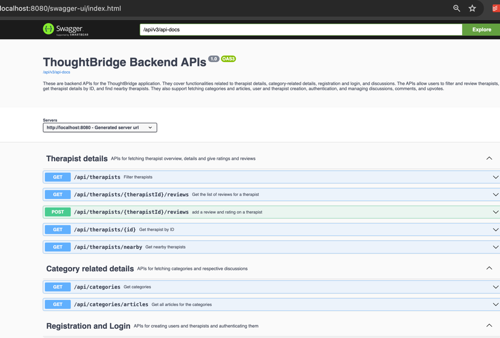

# ThoughtBridge Backend

ThoughtBridge is a comprehensive platform designed to connect users with therapists, providing a streamlined way to manage therapist profiles, user interactions, and discussions. The backend of ThoughtBridge is built using Spring Boot, providing robust APIs for managing therapist details, user registrations, discussions, comments, and upvotes. The application ensures secure authentication and authorization for both users and therapists. It also includes functionalities for filtering therapists, submitting reviews, and managing therapist availability. With ThoughtBridge, users can easily find the right therapist, engage in meaningful discussions, and access a wealth of resources and articles related to mental health and well-being.
## Tech Stack

**Spring Boot**: Simplifies the development of production-ready applications with minimal configuration.

**MongoDB**: A NoSQL database offering high performance and scalability with JSON-like document storage.

**Spring Data MongoDB**: Provides easy integration and data access for MongoDB within Spring applications.

**Spring Boot Starter Web**: Facilitates building web applications and RESTful services using Spring MVC.

**Maven**: A build automation tool used for managing project dependencies and build lifecycle.

**Java**: A widely-used object-oriented programming language known for its portability and robustness.

**Swagger (Springdoc OpenAPI)**: Automates the generation of API documentation in compliance with the OpenAPI Specification.Lombok: Reduces boilerplate code in Java by generating common methods like getters and setters.


**IntelliJ IDEA**:A powerful IDE for Java development, offering advanced coding assistance and integration tools.

**Postman**:A versatile API client used for building, testing, and documenting APIs with ease.

## Installation

Before you begin, ensure you have met the following requirements:
#### Prerequisites

- **Java 8 or higher:** Ensure Java is installed by running `java -version` in your terminal.
- **Maven 3.6.0 or higher:** Ensure Maven is installed by running `mvn -version` in your terminal.
- **MongoDB 4.0 or higher:** Ensure MongoDB is installed and running.
- **MongoDB Compass**: Recommended for viewing and editing documents
- **An IDE like IntelliJ IDEA:** Recommended for better development experience.
- **Postman:** Recommended for testing the APIs.
- **HTTPie**: Testing APIs using terminal.

#### Steps

1. **Clone the Repository:**

   Clone the repository from GitHub to your local machine:

   ```bash
   git clone https://github.com/JAYRAJARORA/thought-bridge-backend.git
   cd thought-bridge-backend
    ```

2. **Configure the database**
Ensure MongoDB is running and accessible. Configure your MongoDB connection settings in the application.properties or application.yml file located in the src/main/resources directory:

```bash
spring.data.mongodb.uri=mongodb://localhost:27017/thoughtbridge
```

3. **Build the Project:**
Use Maven to build the project:

```bash
mvn clean install
```

4. **Run the Application:**
Start the Spring Boot application:

```bash
mvn spring-boot:run
```
5. **Test API using Postman or HTTPie**
Use Postman to test the APIs


## Example APIs

To test some APIs using HTTPie, you can copy the commands:
#### Get nearby therapists based on location entered by user

```bash
  http GET /api/therapists/nearby?latitude=<latitude>&longitude=<longitude>&radius=<radius>
```

| Parameter | Type     | Description                |
| :-------- | :------- | :------------------------- |
| `longitude` | `string` | **Required**. longitude |
| `latitude` | `string` | **Required**. longitude |
| `radius` | `string` | radius |

#### Add a review and rating on the therapist. Review content is optional

```bash
  http POST /api/therapists/${therapistId}/reviews userId=<userId> rating=<rating> content=<content>
```

| Parameter | Type     | Description                       |
| :-------- | :------- | :-------------------------------- |
| `therapistId`| `string` | **Required**. Therapist Id |

#### Fetches articles for all the selected categories

```bash
  http GET /api/categories/articles
```

| Parameter | Type     | Description                       |
| :-------- | :------- | :-------------------------------- |
| `categoryIds`| `string` | **Required**. List of category Ids |


#### Fetches articles for all the selected categories

```bash
  http GET /api/categories/articles?categoryIds=<categoryIds>
```

| Parameter | Type     | Description                       |
| :-------- | :------- | :-------------------------------- |
| `categoryIds`| `string` | **Required**. List of category Ids |


#### Show trending articles

```bash
  http GET /api/discussions/trending
```

#### Add a comment on either an issue or an article

```bash
  http POST /api/discussions/${id}/comments content=<content> author=<userId> createdAt=<createdAt> 
```

| Parameter | Type     | Description                       |
| :-------- | :------- | :-------------------------------- |
| `id`| `string` | **Required**. Id of the discussion(issue/article) |

#### Upvote or downvote an issue or an article

```bash
  http POST /api/discussions/${id}/toggle-vote?userId=<userId>
```

| Parameter | Type     | Description                       |
| :-------- | :------- | :-------------------------------- |
| `id`| `string` | **Required**. Id of the discussion(issue/article) |


#### Update user profile

```bash
  http PUT /api/users/${id}?type=<therapist or user> username=<username> email=<email> password=<password>
```

| Parameter | Type     | Description                       |
| :-------- | :------- | :-------------------------------- |
| `id`| `string` | **Required**. user Id |

## Documentation

API documentation is automatically generated using Springdoc OpenAPI when you run the project and can be accessed 
```
http://localhost:8080/swagger-ui.html
```

## Screenshots

**API Documentation**



**MongoDB Collections**


**IntelliJ code**


**API testing in Postman**


## Acknowledgements

 - [California State University Fullerton](https://www.fullerton.edu/)
- [Spring Boot](https://spring.io/projects/spring-boot)
- [MongoDB](https://www.mongodb.com/docs/)
- [MongoDB Atlas](https://www.mongodb.com/lp/cloud/atlas/try4?utm_source=google&utm_campaign=search_gs_pl_evergreen_atlas_core_retarget-brand_gic-null_amers-us-ca_ps-all_desktop_eng_lead&utm_term=mongodb%20atlas&utm_medium=cpc_paid_search&utm_ad=e&utm_ad_campaign_id=14291004479&adgroup=128837427307&cq_cmp=14291004479&gad_source=1&gclid=Cj0KCQjw3ZayBhDRARIsAPWzx8q1CLnfC9EQke3YpFj-mmmyPNllYRE_xtRWNNWMtTAkPJ3lIUX4MuoaAvnREALw_wcB)


## License

[MIT](https://choosealicense.com/licenses/mit/)

